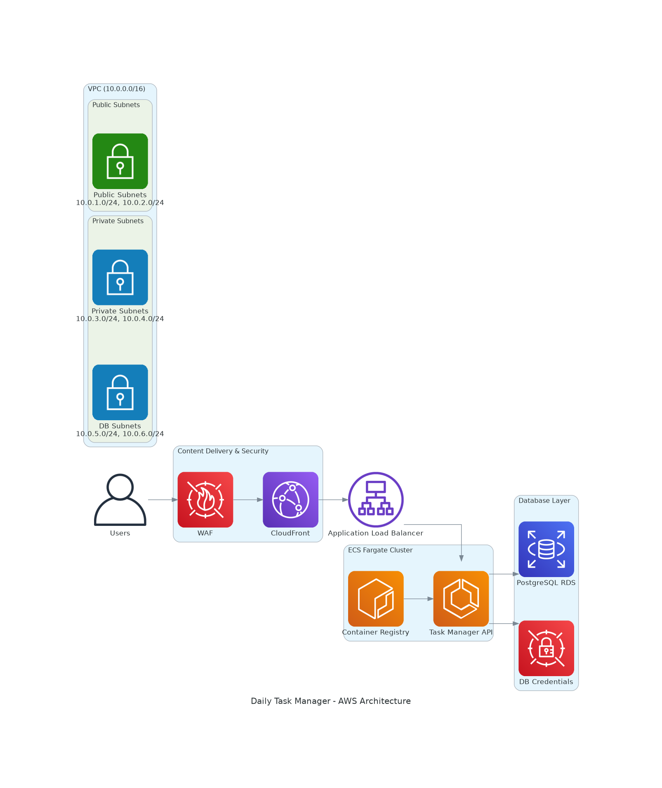

 # Enterprise Task Orchestration Platform - AWS Cloud-Native Architecture

A production-grade, highly available task management microservice built with Node.js and PostgreSQL, deployed on AWS using enterprise-class cloud-native architecture patterns and DevOps best practices.

## Architecture Overview



This application demonstrates a production-ready AWS architecture with the following components:

### Core Services
- **ECS Fargate**: Serverless container orchestration for the Node.js API
- **RDS PostgreSQL**: Managed relational database for task storage
- **Application Load Balancer**: Traffic distribution and health checks
- **CloudFront**: Global content delivery network
- **WAF**: Web application firewall for security

### Security & Networking
- **VPC**: Isolated network environment (10.0.0.0/16)
- **Private Subnets**: Secure placement of application and database tiers
- **Security Groups**: Network-level access control
- **AWS Secrets Manager**: Secure database credential management

## Application Features

- **RESTful API**: Complete CRUD operations for task management
- **Health Checks**: AWS Load Balancer compatible endpoints
- **Database Integration**: PostgreSQL with connection pooling
- **Containerized**: Docker-based deployment for consistency
- **Environment Configuration**: Flexible configuration management

## API Endpoints

| Method | Endpoint | Description |
|--------|----------|-------------|
| GET | `/health` | Health check for load balancer |
| GET | `/tasks` | Retrieve all tasks |
| POST | `/tasks` | Create a new task |
| PATCH | `/tasks/:id/complete` | Mark task as complete |
| DELETE | `/tasks/:id` | Delete a task |

## Technology Stack

### Application
- **Runtime**: Node.js 18+
- **Framework**: Express.js
- **Database Client**: pg (PostgreSQL)
- **Environment**: Docker containerized

### Infrastructure
- **IaC**: Terraform
- **Container Registry**: Amazon ECR
- **Orchestration**: Amazon ECS Fargate
- **Database**: Amazon RDS PostgreSQL 15.14
- **Load Balancing**: Application Load Balancer
- **CDN**: CloudFront with WAF protection

## Project Structure

```
AWS-Projects/
├── app/                          # Application code
│   ├── src/
│   │   └── index.js             # Main application file
│   ├── public/                  # Static frontend files
│   ├── package.json             # Node.js dependencies
│   ├── Dockerfile               # Container configuration
│   └── docker-compose.yml       # Local development setup
├── infra/                       # Infrastructure as Code
│   ├── envs/stage/              # Stage environment configuration
│   │   ├── main.tf              # VPC module configuration
│   │   ├── ecs_service.tf       # ECS service definition
│   │   ├── rds.tf               # Database configuration
│   │   ├── alb.tf               # Load balancer setup
│   │   ├── Cloudfront.tf        # CDN configuration
│   │   ├── waf.tf               # Web application firewall
│   │   └── sg.tf                # Security groups
│   └── module/vpc/              # Reusable VPC module
└── diagrams/          # Architecture diagrams
```

## Infrastructure Details

### Network Architecture
- **VPC CIDR**: 10.0.0.0/16
- **Public Subnets**: 10.0.1.0/24, 10.0.2.0/24 (Multi-AZ)
- **Private Subnets**: 10.0.3.0/24, 10.0.4.0/24 (Application tier)
- **Database Subnets**: 10.0.5.0/24, 10.0.6.0/24 (Database tier)
- **Availability Zones**: eu-west-1a, eu-west-1b

### Security Configuration
- **ECS Tasks**: Run in private subnets with no public IP
- **Database**: Isolated in dedicated subnets, not publicly accessible
- **Load Balancer**: Public-facing with security group restrictions
- **WAF**: Protection against common web exploits

## Getting Started

### Prerequisites
- AWS CLI configured with appropriate permissions
- Terraform >= 1.0
- Docker and Docker Compose
- Node.js 18+ (for local development)

### Local Development

1. **Clone the repository**
   ```bash
   git clone <repository-url>
   cd AWS-Projects
   ```

2. **Start local environment**
   ```bash
   cd app
   docker-compose up -d
   ```

3. **Test the API**
   ```bash
   curl http://localhost:3000/health
   curl http://localhost:3000/tasks
   ```

### AWS Deployment

1. **Navigate to infrastructure directory**
   ```bash
   cd infra/envs/stage
   ```

2. **Initialize Terraform**
   ```bash
   terraform init
   ```

3. **Plan deployment**
   ```bash
   terraform plan
   ```

4. **Deploy infrastructure**
   ```bash
   terraform apply
   ```

5. **Container deployment**
   
   Container build and push to ECR is automated through GitHub Actions workflow. The workflow triggers on:
   - Push to main branch
   - Manual workflow dispatch
   
   The CI/CD pipeline handles:
   - Docker image build
   - ECR authentication
   - Image tagging and push
   - ECS service update

## Environment Variables

### Application Configuration
- `PORT`: Application port (default: 3000)
- `DB_HOST`: Database hostname
- `DB_USER`: Database username
- `DB_PASS`: Database password
- `DB_NAME`: Database name
- `DB_PORT`: Database port (default: 5432)

### Infrastructure Configuration
Variables are defined in Terraform configuration files and can be customized per environment.

## Monitoring and Observability

- **Health Checks**: Built-in health endpoint for load balancer monitoring
- **CloudWatch**: Automatic logging and metrics collection
- **ECS Service**: Auto-scaling based on CPU/memory utilization
- **RDS Monitoring**: Database performance insights

## Security Best Practices

- **Network Isolation**: Multi-tier VPC with private subnets
- **Secrets Management**: Database credentials stored in AWS Secrets Manager
- **WAF Protection**: Web application firewall rules
- **Security Groups**: Principle of least privilege access
- **Container Security**: Non-root user in Docker containers

## Cost Optimization

- **Fargate**: Pay-per-use serverless containers
- **RDS t3.micro**: Cost-effective database instance for development
- **CloudFront**: Reduced data transfer costs
- **Auto Scaling**: Automatic resource adjustment based on demand

## Contributing

1. Fork the repository
2. Create a feature branch
3. Make your changes
4. Test locally with Docker Compose
5. Submit a pull request

## License

This project is licensed under the ISC License.

## Support

For questions or issues, please create an issue in the repository or contact the development team.

---

**Author**: Ghanshyam Ramole  
**Last Updated**: January 2026
